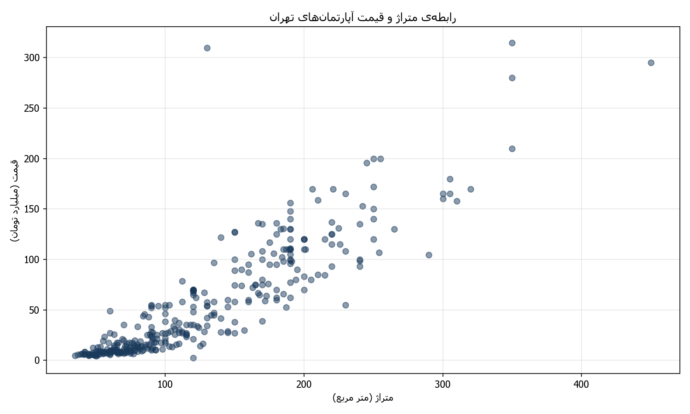
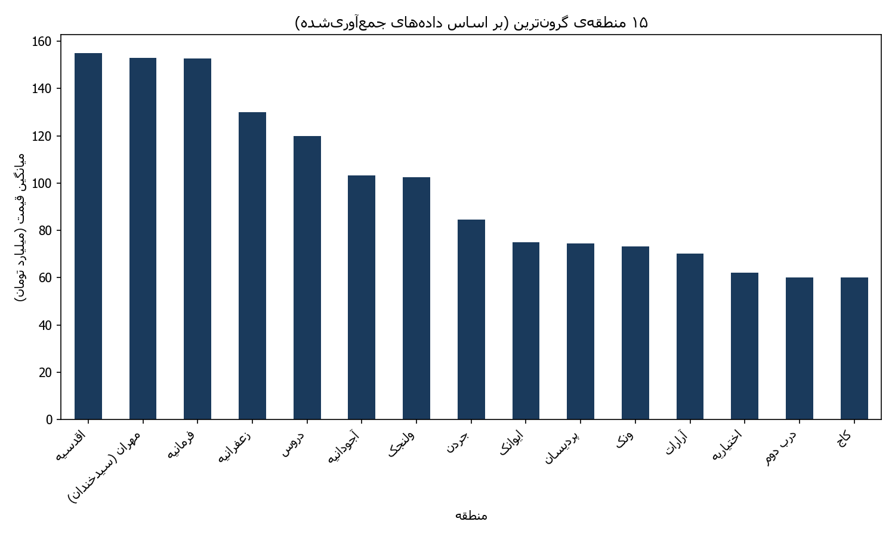

# 🏠 House Price Prediction — Tehran Real Estate

A complete data science portfolio project: scraping real, live listings from Divar.ir (Iran's largest classifieds site), cleaning the data, exploring it visually, and training a machine learning model to predict apartment prices in Tehran.

## 📊 Project Overview

Instead of using a generic public dataset, this project builds a full pipeline from scratch:

## 🔧 Tech Stack

- **Python 3**
- **Selenium** (with Microsoft Edge WebDriver) — for scraping JavaScript-rendered content
- **Pandas** — data cleaning and manipulation
- **Matplotlib** — data visualization (with Persian/RTL text support via `arabic-reshaper` + `python-bidi`)
- **Scikit-learn** — Linear Regression modeling

## 📁 Project Structure

## 🕸️ Data Collection

Listings were scraped from multiple Tehran districts using Selenium, handling several real-world challenges:

- **JavaScript-rendered content**: `requests` alone returned 0 listings — Divar renders listings client-side with React, requiring a real browser (Selenium).
- **ChromeDriver blocked**: Google's driver servers were inaccessible; solved by switching to **Microsoft Edge** and its official driver.
- **Virtualized list rendering**: Divar unloads off-screen listing cards from the DOM while scrolling (to save memory). Solved by detecting the actual scrollable container via JavaScript and collecting cards *after every scroll step*, not just at the end.
- **robots.txt compliance**: Only category pages (not keyword search pages, which are disallowed) were scraped.

**Result:** 375 unique listings from 4 districts → 274 rows with complete features after cleaning.

## 🧹 Data Cleaning

- Normalized mixed Persian/Arabic/English digits (`۱۲۳` / `١٢٣` / `123`) into consistent integers
- Extracted numeric price from strings like `"۷,۸۰۰,۰۰۰,۰۰۰ تومان"` → `7800000000`
- Extracted meterage from listing titles using regex (handling multiple formats)
- Extracted district names from agent descriptions (pattern: `"[Agent] در [District]"`)
- Extracted floor, build year, and room count from each listing's detail page

## 📈 Exploratory Data Analysis

**Price vs. Meterage** — a strong positive relationship, confirming meterage as a key price driver:



**Price by District (Top 15)** — significant price gaps between northern Tehran districts (e.g., Aghdasieh, Ajudanieh) and others:



## 🤖 Model Results

Three Linear Regression models were compared to measure the impact of each feature group:

| Model | Features | R² | Mean Error |
|---|---|---|---|
| 1 | Meterage only | 0.815 | 31.7% |
| 2 | + District | 0.855 | 26.0% |
| 3 | + Floor, Build Year, Rooms | **0.884** | **25.2%** |

Adding district and property details meaningfully improved prediction accuracy, confirming that location and property age/layout are strong price signals beyond size alone.

## ▶️ How to Run

```bash
pip install -r requirements.txt
python src/scraper.py            # Scrape listing cards
python src/scrape_details.py     # Scrape per-listing details
python src/clean_data.py         # Clean basic fields
python src/clean_detailed.py     # Clean detailed fields
python src/analyze.py            # Generate charts
python src/train_model.py        # Train & evaluate models
```

**Note:** Requires Microsoft Edge and its matching WebDriver (`msedgedriver.exe`) placed in the project root.

## 🚀 Possible Next Steps

- Try non-linear models (Random Forest, Gradient Boosting) for potentially higher accuracy
- Scrape more districts to grow the dataset
- Add more features (amenities, renovation status, exact coordinates)

---

## 🇮🇷 خلاصه فارسی

این پروژه یک نمونه‌کار کامل علم داده است: جمع‌آوری آگهی‌های واقعی مسکن تهران از دیوار (با Selenium)، تمیزکاری داده‌ها، تحلیل بصری (EDA)، و در نهایت ساخت یک مدل یادگیری ماشین برای پیش‌بینی قیمت آپارتمان.

**چالش‌های فنی حل‌شده:**
- محتوای رندرشده با جاوااسکریپت (نیاز به Selenium به‌جای requests ساده)
- مسدود بودن سرورهای ChromeDriver (حل‌شده با استفاده از Microsoft Edge)
- سیستم لیست مجازی‌سازی‌شده‌ی دیوار (نیاز به جمع‌آوری داده بعد از هر اسکرول، نه فقط در پایان)

**نتیجه‌ی نهایی:** ۲۷۴ آگهی با فیچرهای کامل (متراژ، منطقه، طبقه، سال ساخت، تعداد اتاق) و یک مدل رگرسیون خطی با **R² = 0.884**.

## 📄 License

MIT